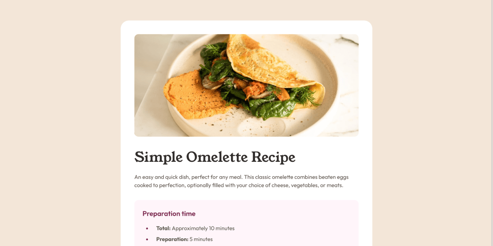

# 🚀 Recipe Page – Frontend Mentor

A responsive recipe page built with semantic HTML and modern CSS, focused on clean structure, reusable styles, and scalable architecture using BEM and design tokens.

This is a solution to the [Recipe page challenge on Frontend Mentor](https://www.frontendmentor.io/challenges/recipe-page-KiTsR8QQKm).

---

## 🎬 Demo

---

## 🔗 Links

- 🌎 [Live site](https://vimpdev.github.io/fem-19-recipe-page-main/)
<!-- - 📌 [Frontend Mentor Solution]() -->

---

## 🎯 Features

- Responsive layout (mobile-first)
- Semantic HTML5 structure
- Reusable and scalable CSS (BEM methodology)
- CSS custom properties (design tokens)
- Layout built with CSS Grid
- Accessible table structure for nutrition data
- Clean and modern UI

---

## 📸 Screenshots

| 📱 Mobile | 📲 Tablet | 🖥️ Desktop |
| --- | --- | --- |
|  |  |  |

---

## 🛠️ Built with

- Semantic HTML5
- Modern CSS
- CSS Grid
- CSS custom properties
- Mobile-first workflow

---

## 📚 What I learned

- Structuring scalable CSS using **BEM methodology**
- Organizing styles with **@layer**
- Creating reusable **design tokens** with CSS variables
- Styling lists using `::marker`
- Building clean and flexible table layouts without breaking semantics

---

## 🤖 AI Collaboration

AI was used as a support tool during the project.

- Reviewing CSS structure and class naming (BEM)
- Exploring layout approaches (Grid vs other options)
- Fixing specific styling issues
- Improving commit messages and project organization

It helped me make better decisions and keep the code more consistent.

---

## 👤 Author

- Frontend Mentor – [@vimpdev](https://www.frontendmentor.io/profile/vimpdev)

---